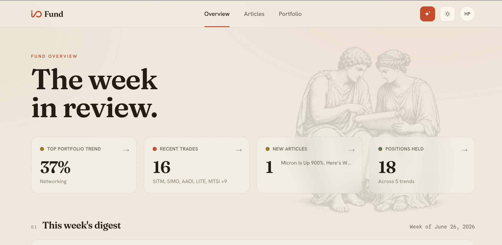
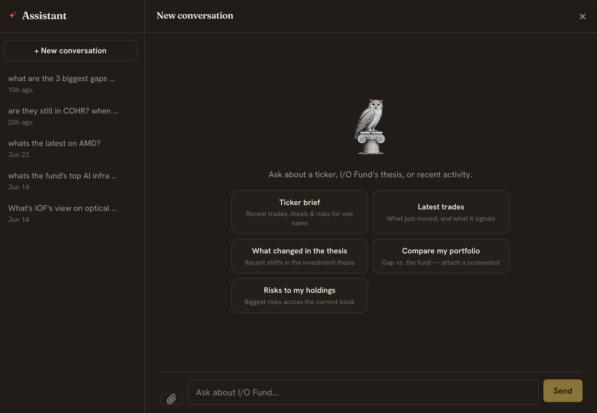

# iofund-iq

An AI layer over an [I/O Investment Fund](https://io-fund.com) subscription: chat over the fund's research, automatic ingestion of new trades and articles, portfolio analysis & comparison.



## What it does

- **Chat.** Ask "what's the view on optical networking?" or "why did they close NVDA?" The agent searches distilled article summaries and the live trade log, then answers with sources.
- **Ingests trades.** A cron polls trade alerts and upserts them into Postgres (1,290+ indexed). Each trade updates a live positions snapshot.
- **Distills articles.** A daily cron fetches each new paywalled article and summarizes it with Sonnet 4.6.
- **Portfolio gap analysis.** Connect a Robinhood account (official Agentic Trading MCP, per-user OAuth, read-only) or paste a brokerage screenshot, and see where your holdings sit against the fund's, by theme. Weights are computed from live Yahoo Finance prices.
- **Weekly digest.** A Friday cron summarizes the week's trades and articles, and opens a PR against the thesis doc when new activity contradicts it. Emailed via Resend.



## Architecture

```
┌─────────────────────────────────────────────────────────────────┐
│                   The user's I/O Fund subscription              │
│           (https://io-fund.com  · Firebase auth)                │
└────────────────────────────┬────────────────────────────────────┘
                             │  polls
                             ▼
       ┌──────────────────────────────────────────────────┐
       │   GitHub Actions crons (scripts/*.py)            │
       │   • poll-trades.yml       · */30 weekdays        │
       │   • discover-articles.yml · 0 14 * * *           │
       │   • ingest-portfolio.yml  · 30 14 * * *          │
       │   • weekly-digest.yml     · 0 21 * * 5           │
       └────────┬─────────────────────────────┬───────────┘
                │                             │
                ▼                             ▼
       ┌────────────────┐         ┌──────────────────────────┐
       │  Neon Postgres │◀────────│  AI Gateway (Sonnet 4.6) │
       │  • trades      │  body    │     distills article     │
       │  • articles    │         └──────────────────────────┘
       │    + body+FTS  │
       │  • positions   │
       │  • iof_creds   │
       └────────┬───────┘
                │
                ▼
       ┌──────────────────────────────────────────────────┐
       │   Next.js 16 chat app  (Vercel)                  │
       │   • Neon Auth (Google + email/password)          │
       │   • AI SDK v6 streamText + 5-step tool loop      │
       │   • Tools: read_doc · query_trades ·             │
       │     search_articles · read_article ·             │
       │     analyze_portfolio_gap · get_my_portfolio ·   │
       │     get_my_realized_pnl                          │
       │   • Sources block from tool-call trace           │
       └──────────────────────────────────────────────────┘
                            ▲
                            │
                          User
```

## Quick start

```bash
cd chat
pnpm install
npx vercel link
npx vercel env pull .env.local --environment=production
pnpm dev
```

Open the URL the dev server prints, sign in, connect your I/O Fund account at `/onboarding/connect-iof`, and start chatting.

Tests: `pnpm test` (TypeScript suites) and `cd scripts && python -m pytest` (Python ingest logic). The cron workflows need `IO_FUND_USERNAME`, `IO_FUND_PASSWORD`, `DATABASE_URL`, and `AI_GATEWAY_API_KEY` as GitHub secrets.

## Credit

I/O Fund's research, trade ideas, and framework material belong to the firm and its team. This project helps a subscriber get more out of an existing subscription. It doesn't redistribute paid content.
